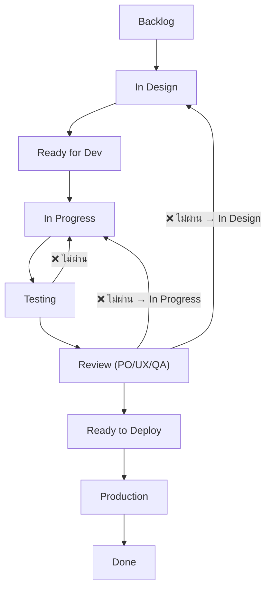
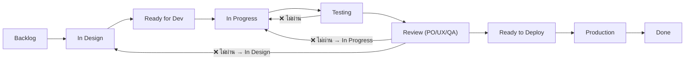

# 📌 JD

| บทบาท | ผู้รับผิดชอบ | หน้าที่หลัก                     |
| ----- | ------------ | ------------------------------- |
| Dev   | เนท / ทาร์ต / ออม / ปอนด์ / บิ๊ก | พัฒนา feature ตาม task   |
| QA    | จันทร์เจ้า / พี่นุ่น   | ทดสอบงานให้ถูกต้อง              |
| Ops   | ชัย / ทาร์ต / เนท       | ปล่อยระบบ, ดูแล server          |
| PM    | เฟรม / เซน / พี่นุ่น | ควบคุมงาน, track งาน, ประสานทีม |
| PO    | ชัย          | กำหนดโจทย์และทิศทาง product     |
| UX/UI | เซน / แบงค์ | ออกแบบอินเทอร์เฟซ (UI)+วิเคราะห์ประสบการณ์ผู้ใช้ (UX) |

 ---

 # Dev Note
 - ให้ Dev เป็นคน update board ทุกวันศุกร์
 - ให้ QA/Tester ช่วย check backlog ร่วมกับบิ๊กทุกต้นสัปดาห์

 ## 🟦 แนวทางแนะนำสำหรับ Dev ที่อยาก “จดงานย่อย” หรือ “เตือนตัวเอง”
 1. Issue Comment (เฉพาะใต้ issue ของตัวเอง)
    - Dev สามารถจดสิ่งที่ต้องทำ, TODO, ความคืบหน้า หรือปัญหาไว้ใน comment ของ issue นั้นๆ ได้เลย
    - ทุกคนเห็นได้ แต่ไม่รก board
    - ตัวอย่าง:
    ```
      TODO:
      - [ ] ตรวจสอบ edge case ตอน login
      - [ ] รองรับการ refresh token
    
      Note: ยังไม่ได้เขียน unit test
    ```

 2. Dev Readme Template
    - markdown หรือ checklist ในไฟล์ markdown -> notes.md ภายใน branch ตัวเอง เช่น `dev-notes/ticket-123.md`

# UX/UI Note
- UX/UI ที่ไม่ได้เขียนโค้ด → แนบงานใน issue หรือแนบ Figma link พร้อม version
- ถ้าทำไฟล์ component หรือ style จริงใน repo → ใช้ branch ตามชื่อ `ux/feature-xyz`, `ui/bugfix-modal-alignment`

- อย่าลืมเชื่อม branch กับ issue ใน GitHub เพื่อให้ดูความคืบหน้าใน Board ได้

# ✅ Workflow Board
```
Backlog
  ↓
In Design
  ↓
Ready for Dev
  ↓
In Progress
  ↓
Testing
    ↳ ❌ ไม่ผ่าน → กลับ In Progress
  ↓
Review (PO/UX/QA)
    ↳ ❌ ไม่ผ่าน → กลับ In Progress หรือ In Design
  ↓
Ready to Deploy
  ↓
Production
  ↓
Done
```
# 📌 คำอธิบายแต่ละขั้น 
| Column              | ผู้รับผิดชอบหลัก | อธิบาย                                     |
| ------------------- | ---------------- | ------------------------------------------ |
| **Backlog**         | PO               | ฟีเจอร์หรือปัญหาที่ยังไม่เริ่ม             |
| **In Design**       | UX/UI            | ออกแบบ UX/UI พร้อม review กับ PO           |
| **Ready for Dev**   | PO + PM          | พร้อมสำหรับการเริ่มพัฒนา                   |
| **In Progress**     | Dev              | อยู่ระหว่างการเขียนโค้ด                    |
| **Testing**         | QA               | ทดสอบฟีเจอร์ / bug                         |
| **Review**          | QA + PO + UX     | ตรวจสอบคุณภาพ การใช้งาน และ business logic |
| **Ready to Deploy** | Dev/Ops          | เตรียม production release                  |
| **Production**      | Ops              | ขึ้นระบบจริง                               |
| **Done**            | ทุกฝ่าย          | ปิดงานเรียบร้อย                            |

# 🔁 วนกลับเมื่อไม่ผ่าน
| ไม่ผ่านตรงไหน          | กลับไปที่                                         |
| ---------------------- | ------------------------------------------------- |
| QA Testing             | In Progress                                       |
| UX/PO Review           | In Progress หรือ In Design                        |
| พบ bug หลัง Production | สร้าง issue ใหม่ เข้าสู่ Backlog หรือ In Progress |

# 📌 Workflow Overview

---

